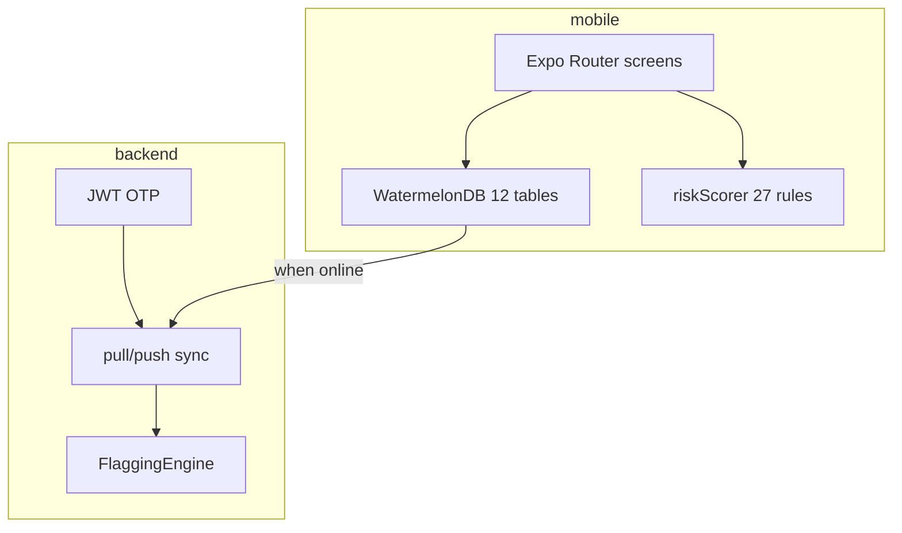

# SHAASTHI — Build Guide Coverage Audit

Senior assessment against the **Final Cursor Build Guide** (Prompts 0–11).  
**Overall: ~62% of the full guide is implemented; ~85% of the pilot-critical path is runnable.**

Last verified: **2026-05-18** — `make eval` PASS (T1–T5) · `make eval-offline` PASS · Jest 17 · Django 12 · Expo Doctor 15/15

---

## Summary by prompt

| Prompt | Area | Built | Notes |
|--------|------|-------|-------|
| **0** | Cursor setup | **95%** | `.cursor/rules/*.mdc`, `.cursor/mcp.json`, `CURSOR_BUILD.md` |
| **1** | RN scaffold | **88%** | JS (not TS); 12 Watermelon tables; sync, Redux, ML, utils |
| **2** | Components | **82%** | GovtHeader, OfflineBanner, SyncIndicator, RiskBadge, PatientCard, ImmunizationRow, SymptomCard, etc. |
| **3** | Auth | **75%** | Login + OTP + auth guard; dev OTP tap-to-fill; offline pilot fallback |
| **4** | Home + tabs | **72%** | 4 tabs, Home stats, quick actions; partial MCP alerts |
| **5** | Patients | **68%** | List, 3-step add, profile; not full MCP/JSY/GPS spec |
| **6** | Survey + risk | **74%** | 7-step survey, `surveySubmit.js`, TB heuristic, 27 risk rules |
| **7** | MCP screens | **58%** | ANC 1–5 + PMSMA, immunization, growth bands, PNC, child-dev stub |
| **8** | Earnings / follow-ups / sync | **70%** | Wallet, week strip, sync breakdown; badges partial |
| **9** | Django backend | **45%** | `backend` sync+OTP+flagging; not full `shaasthi-backend` domain split |
| **10** | Admin dashboard | **0%** | `shaasthi-dashboard/` not started |
| **11** | Audit + fixes | **80%** | `eval/` suite + compliance checks; not manual screen-by-screen |

---

## What runs today (pilot path)

1. **API** — `scripts/dev.sh` or `python manage.py runserver`
2. **App** — `cd mobile && npx expo start`
3. **Login** — OTP from API `dev_otp` (tap hint on OTP screen)
4. **Offline** — WatermelonDB writes, risk score, sync when online

---

## Automated quality gates

```bash
make eval-offline   # T1 Jest + T2 Django + T3 contracts + T5 compliance
make eval           # + T4 live API (needs :8000)
```

| Check | Status |
|-------|--------|
| Contract shape (12 sync tables) | PASS |
| Risk golden fixtures | PASS |
| Survey submit / TB side effects | PASS |
| OTP + worker scope + sync survey | PASS |
| Compliance (Aadhaar last-4, no fetal sex) | PASS |
| Expo SDK 50 dependency alignment | PASS |

---

## Gaps vs guide (prioritized)

### Critical for production (not blocking local pilot)

- Full **REST CRUD** per resource (app uses **sync-only** API — by design for offline-first)
- **9 flagging rules** on server — **implemented** in `FlaggingEngine` (critical, TB, high risk, missed follow-up, anemia, SAM, MAM, immunization defaulter)
- **25+ sklearn** training pipeline (stub only)
- **Admin dashboard** (Prompt 10)

### High (UX / MCP Card parity)

- Survey: 6-step guide layout vs current 7-step; village TB cluster UI; full symptom SVG set
- ANC: full MCP page-5 fields (USG, GDM, HIV, fundal height, etc.)
- Immunization: FIC progress bar + `FIC_COMPLETE` / per-vaccine incentives on mark-given
- Growth: full WHO 0–36mo chart vs simplified bands
- Earnings: badge system, month navigator
- Add patient: GPS, full household register, consent persistence

### Medium

- TypeScript migration (guide assumed TS template)
- Remove legacy `src/db/` duplicate layer
- `expo-notifications`, push for critical flags
- Postgres + Redis in CI (docker-compose exists; SQLite default for dev)

### Low

- 10k Faker mock load test
- Component isolation tests (`__tests__/index.test.js` per guide)
- EAS build profiles

---

## Architecture (actual vs guide)



Guide also references `shaasthi-backend/` (legacy pilot REST) — **not** the primary sync target.

---

## Recommendation

**Ship pilot** with current stack: mobile + `backend` + `make eval` in CI.  
**Next sprint:** immunization FIC incentives, remaining flagging rules, ANC field parity, then admin dashboard.

See [RUNBOOK.md](RUNBOOK.md) for run instructions.
