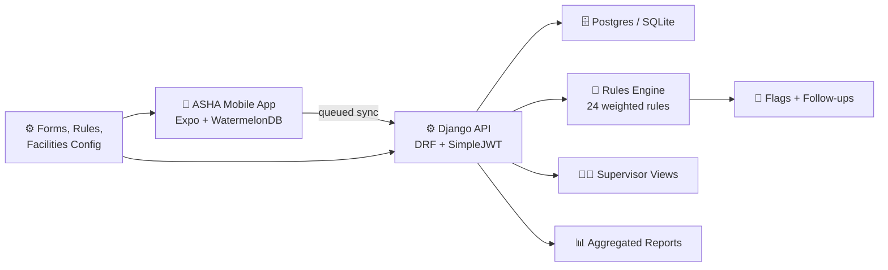

# MEDILIFT — Digital ASHA Healthcare Platform

> **Offline-first mobile platform for India's 10 lakh+ ASHA health workers.**
> Digitize household surveys, MCP Card workflows, explainable risk scoring, and supervisor dashboards — all working without internet.


---

## Why MEDILIFT?

ASHA (Accredited Social Health Activist) workers serve as the first point of contact for healthcare in rural India. They still use paper registers and manual MCP cards, leading to missed follow-ups, delayed risk detection, and lost data. MEDILIFT solves this with:

- **Offline-first data capture** — register households, record surveys, and track patients with zero connectivity
- **Explainable risk scoring** — 24-rule weighted engine flags high-risk patients with human-readable reasons in Hindi + English
- **MCP Card digitization** — ANC visits, immunization tracking, growth monitoring, and entitlement management
- **Auto-sync** — WatermelonDB queued sync pushes data when connectivity returns
- **Supervisor dashboards** — aggregated views, flag management, and CSV exports (PII-safe)
- **Incentive ledger** — activity and quality based rewards, never referral-volume commissions

---

## Architecture



---

## Quick Start

### Prerequisites

| Tool | Version | Notes |
|------|---------|-------|
| Node.js | 20+ | `node -v` |
| Python | 3.9+ | `python3 --version` |
| Xcode | 15+ | iOS Simulator (macOS only) |
| Android Studio | Latest | Android Emulator (optional) |

> **⚠️ Expo Go is NOT supported.** WatermelonDB requires a native build. Use `npm run native:ios` or `npm run native:android`.

### 1. Clone & Setup

```bash
git clone https://github.com/Luciferai04/Shaasthi.git
cd Shaasthi
```

### 2. Start the Backend API

```bash
chmod +x scripts/dev.sh
./scripts/dev.sh
```

This will:
- Create a Python virtual environment
- Install dependencies
- Run migrations
- Generate demo data (1 worker, 3 patients)
- Start the API on `http://127.0.0.1:8000`

<details>
<summary>Manual backend setup</summary>

```bash
cd medilift-api
python3 -m venv .venv && source .venv/bin/activate
pip install -r requirements/dev.txt
python manage.py migrate
python manage.py generate_mock_data --workers 1 --patients 5
python manage.py runserver 127.0.0.1:8000
```

</details>

### 3. Build & Run the Mobile App

```bash
cd medilift-app
npm install
npm run native:ios       # First run: ~5-15 min (builds native modules)
```

For Android:
```bash
npm run native:android   # Requires Android Studio + emulator
```

**Daily development** (after first native build):
```bash
npm start                # Press 'i' for iOS simulator
```

### 4. Login

1. Enter any 10-digit Indian mobile number (e.g. `9876543210`)
2. Tap **Send OTP**
3. The API returns a dev OTP — tap the green **Dev OTP** banner to auto-fill
4. You're in! 🎉

For offline/pilot mode: tap **"Pilot login (no server)"** — works without the API.

---

## OTP Authentication

**No SMS provider is needed for development or pilot testing.**

The backend generates OTPs in-memory and returns them directly in the API response:

```
POST /api/v1/auth/otp/request/  →  { "dev_otp": "482916" }
POST /api/v1/auth/otp/verify/   →  { "access": "...", "refresh": "..." }
```

The mobile app displays the dev OTP as a tappable green banner. For production, integrate [MSG91](https://msg91.com/) or [Twilio](https://twilio.com/) — the `.env.example` already has the `SMS_PROVIDER_API_KEY` placeholder.

---

## Project Structure

```
Shaasthi/
├── medilift-app/                 # 📱 Expo React Native mobile app
│   ├── app/                      #    File-based routing (expo-router)
│   │   ├── (auth)/               #    Login, OTP, splash screens
│   │   └── (tabs)/               #    Home, patients, follow-ups, earnings, MCP, sync
│   ├── src/
│   │   ├── api/                  #    Axios client + JWT interceptors
│   │   ├── components/           #    27 reusable UI components
│   │   ├── constants/            #    Colors, typography, i18n, API config
│   │   ├── database/             #    WatermelonDB schema, sync, background sync
│   │   ├── features/             #    Redux slices (auth, patients, survey, sync, earnings)
│   │   ├── ml/                   #    On-device risk scoring engine (24 rules)
│   │   ├── screens/              #    Screen implementations
│   │   └── store/                #    Redux store + AppProvider
│   └── __tests__/                #    Jest test suites (17 specs)
│
├── medilift-api/                 # ⚙️ Django API (primary backend)
│   ├── apps/
│   │   ├── accounts/             #    OTP auth + JWT
│   │   ├── patients/             #    Patient CRUD
│   │   ├── sync_api/             #    WatermelonDB pull/push endpoints
│   │   ├── flagging/             #    Auto-flagging engine
│   │   └── risk_engine/          #    Server-side risk scoring
│   ├── config/                   #    Django settings (dev/prod)
│   └── tests/                    #    Django test suites (12 specs)
│
├── medilift-backend/             # ⚙️ Extended backend (RBAC, surveys, audit)
│   ├── accounts/                 #    Custom User model with roles
│   ├── registry/                 #    Household + patient registry
│   ├── surveys/                  #    Survey definitions + responses
│   ├── risk_engine/              #    Server-side risk rules
│   ├── flagging/                 #    Flag deduplication
│   ├── sync/                     #    Sync event logging
│   ├── referrals/                #    Referral management
│   ├── incentives/               #    Quality-based incentive ledger
│   └── analytics/                #    Aggregated exports
│
├── docs/                         # 📚 Architecture & contracts
│   ├── architecture.md           #    System design + bounded contexts
│   ├── data-dictionary.md        #    Field definitions
│   ├── sync-contract.md          #    Sync protocol spec
│   ├── risk-rule-contract.md     #    Risk rule definitions
│   └── compliance-checklist.md   #    Privacy & safety compliance
│
├── contracts/                    # 📋 Machine-readable API examples
├── eval/                         # ✅ Automated test harness (9 suites)
└── scripts/                      # 🔧 Dev bootstrap scripts
```

---

## Environment Variables

Copy `.env.example` to `.env` and adjust:

| Variable | Default | Description |
|----------|---------|-------------|
| `EXPO_PUBLIC_API_URL` | `http://127.0.0.1:8000/api/v1` | Mobile app → API base URL |
| `DJANGO_SECRET_KEY` | `change-me-in-production` | Django secret key |
| `DJANGO_DEBUG` | `true` | Enables debug mode + dev OTP in responses |
| `DATABASE_URL` | `sqlite:///db.sqlite3` | Database connection (Postgres supported) |
| `CORS_ALLOWED_ORIGINS` | `http://localhost:8081` | CORS whitelist for Expo |
| `SMS_PROVIDER_API_KEY` | *(empty)* | MSG91/Twilio key (production only) |

**Physical device:** set `EXPO_PUBLIC_API_URL` to your LAN IP, e.g. `http://192.168.1.10:8000/api/v1`.

---

## Testing

```bash
# All 9 evaluation suites (requires API on :8000)
make eval

# Offline-only tests (no server needed)
make eval-offline

# Mobile unit tests (17 specs)
cd medilift-app && npm test

# Backend unit tests (12 specs)
cd medilift-api && source .venv/bin/activate && python manage.py test tests
```

**Current status:** All 9/9 eval suites passing ✅

---

## Key Design Decisions

| Decision | Rationale |
|----------|-----------|
| **WatermelonDB** over AsyncStorage | Proper relational queries for patient-survey joins, observable queries for reactive UI, built-in sync protocol |
| **On-device risk scoring** | Works offline; server mirrors the same rules for validation |
| **Bilingual UI (Hindi + English)** | ASHA workers are primarily Hindi-speaking; supervisors may use English |
| **No Expo Go** | WatermelonDB requires native SQLite bridge — Expo Go doesn't link native modules |
| **JWT + OTP (no passwords)** | ASHA workers in the field shouldn't manage passwords; phone OTP is the standard |
| **Incentives ≠ referral volume** | Ethical design — rewards quality visits and training, never per-patient brokerage |

---

## Troubleshooting

| Problem | Solution |
|---------|----------|
| `WMDatabaseBridge is not defined` | You're on Expo Go — run `npm run native:ios` instead |
| `No route named "patients"` | Ensure `app/(tabs)/patients/_layout.jsx` exists; restart Metro |
| Port 8000 already in use | `lsof -i :8000` → `kill <PID>` |
| iOS build fails | `cd medilift-app/ios && pod install` then retry |
| "डेटाबेस लोड नहीं हुआ" | Reinstall the dev build; do not use Expo Go |
| OTP not received | In dev, OTP is in the API response (`dev_otp`). No SMS provider needed |

---

## API Documentation

With the API running, visit:
- **Swagger UI:** http://127.0.0.1:8000/api/docs/
- **OpenAPI Schema:** http://127.0.0.1:8000/api/schema/

---

## Non-Negotiables

- ✅ Every field workflow works **offline**
- ✅ Every write records **sync and audit metadata**
- ✅ Risk outputs always include **human-readable reasons**
- ✅ Incentives reward **quality and outcomes**, never referral volume
- ✅ Analytics exports are **aggregated/anonymized** unless authorized

---

## Contributing

1. Fork the repository
2. Create a feature branch: `git checkout -b feature/my-feature`
3. Run tests: `make eval-offline && cd medilift-app && npm test`
4. Commit with clear messages: `git commit -m "feat: add immunization reminder"`
5. Push and open a PR

---

## License

This project is licensed under the MIT License. See [LICENSE](LICENSE) for details.

---

<p align="center">
  <strong>Built for India's frontline health workers 🇮🇳</strong><br/>
  <sub>राष्ट्रीय स्वास्थ्य मिशन | National Health Mission</sub>
</p>
