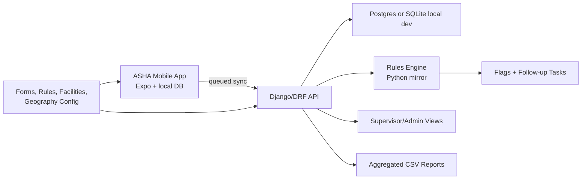

# MEDILIFT Pilot Architecture

## Goal

Build a production-shaped pilot, not a national-scale replacement. The MVP proves that ASHAs can capture household and beneficiary data offline, digitize key MCP Card workflows, generate explainable risk flags, and sync to supervisor dashboards.

## System Shape

## Bounded Contexts

- **Identity:** users, roles, ASHA workers, supervisors, device binding, OTP login.
- **Registry:** households, patients/beneficiaries, geography, consent.
- **Encounters:** ASHA survey, MCP visits, daily activity, disease surveillance.
- **MCP:** mother records, ANC/PNC, immunization, growth, development, entitlements.
- **Risk:** rules, evaluated factors, score history, advisory ML metadata.
- **Workflow:** flags, follow-ups, referrals, provider routing, outcomes.
- **Incentives:** event ledger, approval state, payout state, no referral-volume commission.
- **Sync:** WatermelonDB-style pull/push, local UUID idempotency, sync receipts.
- **Analytics:** aggregated dashboards and PII-safe exports.

## Offline-First Rules

- The mobile app writes locally first for registration, survey, MCP, referral, follow-up, and incentive events.
- Every syncable record carries `local_uuid`, `server_id`, `is_synced`, `is_deleted`, `is_mock`, `created_at`, and `updated_at`.
- Clinical/event records are append-oriented. Destructive overwrite is only acceptable for low-risk metadata.
- The server returns canonical IDs, failed-record reasons, and config/rule versions after sync.

## MVP Delivery Boundary

The pilot includes a minimal Django supervisor/admin surface. A separate Next.js dashboard is intentionally deferred until pilot workflows stabilize.

